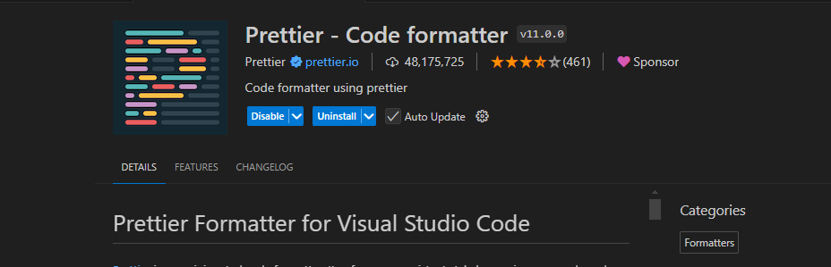

mọi người cần tải extension Prettier - Code formatter

video hướng dẫn cài: https://www.youtube.com/watch?v=1s8iJZltSlo
Design lại page NoMatch cho đẹp

I. Các thư viện
* Dependency
1. @testing-library/jest-dom
Tác dụng: Thêm các phương thức mở rộng cho Jest (thư viện kiểm thử) để kiểm tra các DOM element trong các component React.
Lý do sử dụng: Cung cấp các phương thức như .toBeInTheDocument() để kiểm thử sự hiện diện của các phần tử trong DOM.
Phạm vi sử dụng: Kiểm thử các component giao diện trong React, đặc biệt là khi muốn kiểm tra sự hiển thị của các phần tử HTML.
2. @testing-library/react
Tác dụng: Thư viện kiểm thử cho các component React, cho phép render và tương tác với các component trong môi trường kiểm thử.
Lý do sử dụng: Giúp dễ dàng kiểm thử các component React mà không cần phải thực hiện các thao tác DOM phức tạp.
Phạm vi sử dụng: Sử dụng trong các bài kiểm thử unit và integration cho các component React.
3. @testing-library/user-event
Tác dụng: Cung cấp API để mô phỏng các hành động của người dùng (như click, nhập liệu) trong các bài kiểm thử.
Lý do sử dụng: Giúp mô phỏng các tương tác người dùng một cách chính xác và gần với thực tế hơn so với việc thao tác trực tiếp với DOM.
Phạm vi sử dụng: Dùng kết hợp với @testing-library/react để kiểm tra các tương tác người dùng trong các component.
(3 Cái đầu tiên tự có khi tạo project reactjs)
4. axios
Tác dụng: Thư viện HTTP client giúp gọi API dễ dàng với cú pháp đơn giản.
Lý do sử dụng: Thực hiện các yêu cầu HTTP (GET, POST, PUT, DELETE) tới backend hoặc các dịch vụ bên ngoài.
Phạm vi sử dụng: Gửi và nhận dữ liệu từ server hoặc các API bên ngoài. Sử dụng trong các component hoặc trong các module gọi API.
5. classnames
Tác dụng: Thư viện nhỏ gọn giúp kết hợp các class CSS một cách linh hoạt dựa trên các điều kiện.
Lý do sử dụng: Giúp dễ dàng quản lý các class CSS khi có điều kiện phức tạp mà không cần phải viết logic thủ công.
Phạm vi sử dụng: Áp dụng cho các component nơi có nhiều điều kiện hiển thị khác nhau, giúp dễ dàng xử lý trạng thái của các class CSS.
Khi sử dụng classname với file scss có dạng abc.moudle.scss sẽ module hóa các class trong các component để giúp các tên class không bị trùng lặp
6. normalize.css
Tác dụng: Thư viện CSS reset giúp chuẩn hóa cách các trình duyệt hiển thị các phần tử HTML mặc định.
Lý do sử dụng: Đảm bảo các phần tử HTML hiển thị nhất quán trên các trình duyệt khác nhau.
Phạm vi sử dụng: Áp dụng ở cấp độ toàn cầu cho toàn bộ ứng dụng, giúp giảm sự khác biệt giữa các trình duyệt.
7. react
Tác dụng: Thư viện JavaScript dùng để xây dựng giao diện người dùng.
Lý do sử dụng: Là nền tảng chính của dự án, giúp xây dựng các component giao diện một cách dễ dàng và có tính năng tái sử dụng.
Phạm vi sử dụng: Sử dụng ở khắp mọi nơi trong dự án để phát triển các trang web động.
8. react-dom
Tác dụng: Cung cấp API để render các component React vào trong DOM thực tế của trình duyệt.
Lý do sử dụng: Là cầu nối giữa React và DOM của trình duyệt, giúp kết nối các component với giao diện thực tế.
Phạm vi sử dụng: Được sử dụng khi render toàn bộ ứng dụng hoặc các component vào trong trình duyệt.
9. react-lazyload
Tác dụng: Thư viện giúp trì hoãn tải các hình ảnh hoặc component không cần thiết khi trang chưa scroll tới, nhằm tối ưu hóa hiệu suất.
Lý do sử dụng: Giảm tải dữ liệu không cần thiết, cải thiện tốc độ load trang bằng cách chỉ tải các thành phần cần thiết khi chúng hiển thị trong viewport.
Phạm vi sử dụng: Sử dụng cho các trang có nhiều nội dung hình ảnh hoặc các component nặng.
Các sử dụng trong code thì xem trong file Route.js với 2 component NewProduct và FeatureProduct
10. react-router-dom
Tác dụng: Thư viện giúp định tuyến trong các ứng dụng React một cách dễ dàng.
Lý do sử dụng: Quản lý các route, điều hướng người dùng giữa các trang khác nhau trong ứng dụng.
Phạm vi sử dụng: Áp dụng cho việc tạo các hệ thống route công khai và bảo mật, chuyển trang không cần reload.
Khi khai báo một route mới thì khai báo ở file Routes.js
11. react-scripts
Tác dụng: Cung cấp các tập lệnh mặc định cho dự án React được khởi tạo từ Create React App, bao gồm build, phát triển, và kiểm thử.
Lý do sử dụng: Giúp cấu hình mặc định cho môi trường phát triển và build của ứng dụng React mà không cần tự cấu hình từ đầu.
Phạm vi sử dụng: Sử dụng khi chạy lệnh build, start, test trong môi trường phát triển.
12. web-vitals
Tác dụng: Thư viện giúp đo lường hiệu suất của trang web dựa trên các chỉ số cốt lõi (Core Web Vitals).
Lý do sử dụng: Đánh giá và tối ưu hóa hiệu suất của ứng dụng, đảm bảo các tiêu chí của Core Web Vitals.
Phạm vi sử dụng: Theo dõi hiệu suất trang trong quá trình phát triển và tối ưu hóa.
* DevDependency
1. babel-plugin-module-resolver
Tác dụng: Plugin Babel giúp thiết lập alias cho các module, giúp import module dễ dàng hơn.
Lý do sử dụng: Tránh việc sử dụng đường dẫn tương đối phức tạp khi import các module, giúp cải thiện khả năng đọc code.
Phạm vi sử dụng: Áp dụng trong quá trình build ứng dụng, cấu hình trong .babelrc hoặc babel.config.js.
Trước khi sử dụng babel-plugin-module-resolver:
import Button from '../../../components/Button';
import Header from '../../../components/Header';
Sau khi sử dụng babel-plugin-module-resolver:
import Button from '~/components/Button';
import Header from '~/components/Header';
Với ~/nó sẽ quét bắt đầu từ thư mục src và hiển thị gợi ý
2. customize-cra
Tác dụng: Thư viện cho phép tùy chỉnh cấu hình mặc định của Create React App mà không cần phải eject ra khỏi CRA.
Lý do sử dụng: Cho phép cấu hình các thiết lập của Webpack hoặc Babel theo yêu cầu mà không mất lợi ích từ CRA.
Phạm vi sử dụng: Sử dụng trong các dự án yêu cầu cấu hình riêng cho build hoặc phát triển mà không muốn eject.
3. react-app-rewired
Tác dụng: Thư viện giúp ghi đè cấu hình mặc định của Create React App mà không cần eject.
Lý do sử dụng: Tùy chỉnh cấu hình Webpack hoặc các công cụ khác mà vẫn giữ được các tính năng từ CRA.
Phạm vi sử dụng: Áp dụng trong các dự án yêu cầu cấu hình bổ sung hoặc ghi đè cấu hình mặc định.
4. sass
Tác dụng: Tiền xử lý CSS giúp viết CSS hiệu quả hơn với các tính năng như biến, lồng ghép, và mixin.
Lý do sử dụng: Giúp quản lý và viết CSS tốt hơn, hỗ trợ trong việc tạo ra các theme và cấu trúc style phức tạp.
Phạm vi sử dụng: Sử dụng để viết và biên dịch các file .scss hoặc .sass thành CSS.
II. Cài đặt và thiết lập
- Clone repository
- Cài các phụ thuộc: npm install
- Chạy server phát triển: npm start
III. Cấu trúc thư mục hiện tại
src/
├── components/
│   ├── GlobalStyles/
│   ├── ItemList/
│   └── Spinner/
├── Layouts/
│   ├── AdminLayout/
│   └── DefaultLayout/
├── pages/
├── Routes/
├── utils/
│   ├── AuthUtil/
│   ├── Pagination/
│   └── request.js
└── App.js
Tổng Quan Thư Mục
components/: Chứa các component có thể tái sử dụng trong React, như ItemList, Spinner, v.v.
Layouts/: Các component layout như AdminLayout và DefaultLayout, xác định cấu trúc trang.
pages/: Các component cho các trang khác nhau trong ứng dụng.
Routes/: Cấu hình các route trong ứng dụng, bao gồm cả public và private routes.
utils/: Chứa các hàm tiện ích và module hỗ trợ, như AuthUtil để xử lý xác thực và Pagination để xử lý phân trang.
App.js: Component gốc của dự án, nơi kết hợp mọi thứ.
IV. Mô tả các file
1. src/components/
GlobalStyles/: Chứa các style toàn cục, ví dụ như các style reset hoặc theme chung cho toàn ứng dụng.
ItemList.js: Component hiển thị danh sách các item, có thể tái sử dụng trên nhiều trang để hiển thị dữ liệu.
Spinner.js: Component loading spinner, được sử dụng để hiển thị trạng thái loading khi đang tải hoặc xử lý dữ liệu.
2. src/Layouts/
AdminLayout/: Định nghĩa layout cho phần admin, bao gồm header, sidebar, v.v.
DefaultLayout/: Layout chuẩn cho các trang công khai, bao gồm các phần như header và footer.
3. src/pages/
Chứa các component cho các trang cụ thể. Mỗi trang có một thư mục và một file .js tương ứng để dễ quản lý.
4. src/Routes/
Xử lý việc định tuyến giữa các trang khác nhau. Bao gồm cả các route công khai (mọi người có thể truy cập) và các route riêng tư (cần xác thực).
5. src/utils/
AuthUtil/: Chứa các tiện ích liên quan đến xác thực như context và hook để xử lý đăng nhập.
Pagination/: Xử lý logic phân trang cho các component hiển thị dữ liệu.
request.js: Xử lý các yêu cầu HTTP và API, sử dụng fetch hoặc axios để gọi dữ liệu.
6. Quy Ước Đặt Tên Component
Quy Ước Đặt Tên Component: Tất cả các component phải tuân theo quy tắc PascalCase (ví dụ: ItemList.js, AdminLayout.js).
File Component: Mỗi component nên nằm trong thư mục riêng nếu nó có kèm theo các style hoặc tài nguyên khác, ví dụ: ItemList/ItemList.js.
File Index: Tránh sử dụng file index.js trừ khi thư mục chứa nhiều component hoặc tài nguyên. Mỗi component nên có tên file riêng để dễ dàng nhận biết.
7. Best Practices
Cấu Trúc Code: Giữ cho các component nhỏ gọn và có thể tái sử dụng. Phân tách các component lớn thành các phần nhỏ hơn.
Styling: Sử dụng CSS Modules hoặc styled-components cho style ở cấp độ component để tránh xung đột. Các style chung thì để vào GlobalStyles/.
Routing: Định nghĩa tất cả các route trong thư mục Routes/, phân biệt rõ giữa public và private routes. Sử dụng RequireAuth cho các route cần xác thực.
Xử Lý Lỗi: Luôn xử lý lỗi API một cách hợp lý và cung cấp phản hồi cho người dùng thông qua các component như Spinner hoặc thông báo lỗi.
Quản Lý Trạng Thái: Sử dụng quản lý trạng thái mặc định của React (Context API, useState, useReducer). Các trạng thái toàn cục nên được giữ trong AuthProvider hoặc các context tương tự.
V. Ví dụ file index.js
Câu lệnh export { publicRoutes, privateRoutes } from './Routes'; trong file index.js có ý nghĩa như sau:

1. Export trực tiếp từ một module khác:
Câu lệnh này cho phép bạn xuất các thành phần (ở đây là publicRoutes và privateRoutes) từ file ./Routes mà không cần phải import chúng vào file index.js trước.
Đây là cách rút gọn giúp truyền tải nội dung từ file ./Routes sang các file khác mà không cần viết thêm các dòng lệnh trung gian.
2. Chi tiết hoạt động:
publicRoutes và privateRoutes được định nghĩa và xuất trong file ./Routes.js.
Thay vì phải viết:
import { publicRoutes, privateRoutes } from './Routes';
export { publicRoutes, privateRoutes };
Bạn có thể rút gọn thành câu lệnh duy nhất:
export { publicRoutes, privateRoutes } from './Routes';
3. Lợi ích của cách viết này:
Gọn gàng hơn: Giảm số lượng dòng lệnh, giúp file index.js ngắn gọn.
Cấu trúc quản lý module tốt hơn: Khi bạn có nhiều file trong một thư mục, bạn thường sử dụng file index.js để đóng gói và quản lý chúng. Bằng cách này, bạn có thể tạo một điểm tập trung để xuất các modules của thư mục ra ngoài. Ví dụ:
// In Routes/index.js
export { publicRoutes, privateRoutes } from './Routes';
Khi đó, các file bên ngoài có thể sử dụng cú pháp ngắn hơn:
import { publicRoutes, privateRoutes } from './Routes';
4. Ứng dụng thực tế:
File index.js trong mỗi thư mục được dùng như một trung tâm để quản lý tất cả các module trong thư mục đó. Nó giúp bạn tổ chức lại code và dễ dàng hơn trong việc quản lý, đặc biệt là khi dự án phát triển lớn hơn với nhiều file.
Khi các thành phần (publicRoutes, privateRoutes) cần được sử dụng ở các phần khác trong ứng dụng, bạn chỉ cần import từ ./Routes mà không phải quan tâm đến chi tiết nội bộ của file ./Routes.
Tóm lại:
Câu lệnh này giúp tái xuất (re-export) các thành phần từ một module khác (./Routes) một cách gọn gàng, đồng thời hỗ trợ trong việc quản lý code và giảm thiểu sự lặp lại không cần thiết trong ứng dụng.
